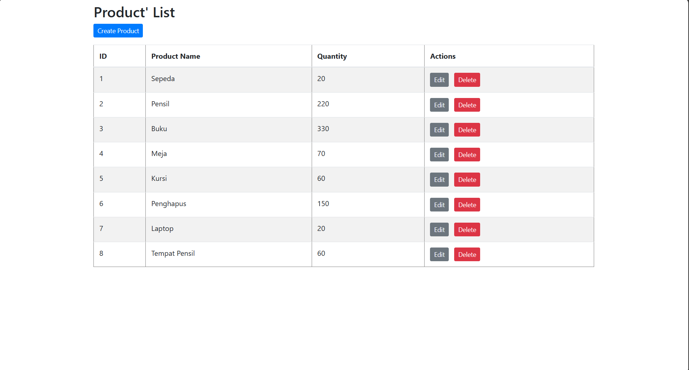
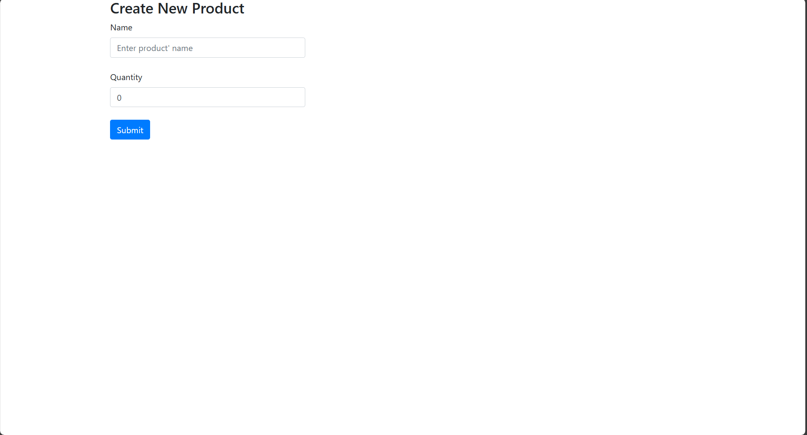
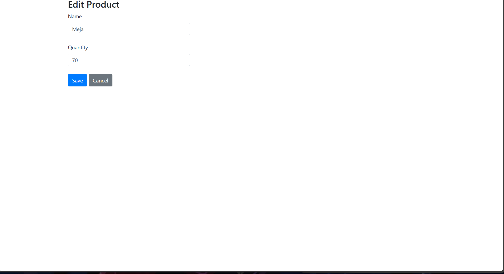
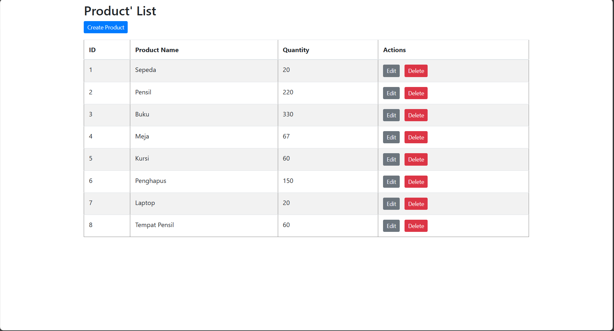
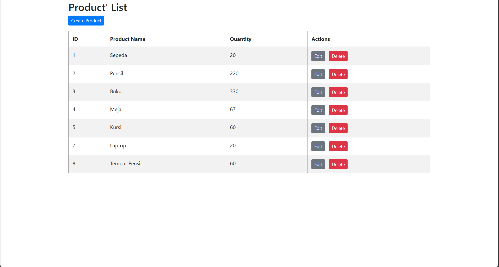

Refleksi Singkat

## Ringkasan exercise :

Tugas exercise yang merupakan lanjutan dari Tutorial

- fitur edit product: endpoint untuk menampilkan form edit, template EditProduct.html, service dan repository ada findById dan update.

- fitur delete product: endpoint untuk menghapus berdasarkan id, service dan repository ada deleteById, serta tombol Delete di ProductList.html.

## Prinsip clean code yang diterapin:

- Single Responsibility : setiap kelas punya tanggung jawab jelas — ProductController buat routing,ProductService buat logika bisnis, Product repository buat akses data.
- Penamaan yang jelas: nama method seperti findById, update, deleteById gampang dimengerti.
- Keterpisahan layer (layered architecture): controller -> service -> repository pengujian dan penggantian implementasi penyimpanannya lebih mudah.
- Template sederhana & terstruktur: template Thymeleaf dipisahkan, form menggunakan th:object dan th:field untuk binding.

## Secure coding pratice:

- Redirect absolut: menggunakan redirect:/product/list untuk menghindari redirect relatif yang bisa menyebabkan routing keliru.

- Validasi tipe parameter: endpoint delete/edit mengharapkan int id; controller memakai @PathVariable ber-typed sehingga Spring memvalidasi tipe.

## Hal yang dapat diperbaiki:

1. Tidak ada validasi input lebih lanjut: saat ini tidak ada validasi nilai productName atau productQuantity (karna tidak disuruh juga di modul). Perbaikan: bisa dengan tambahin validasi pake Bean Validation pada Product dan tangani binding errors di controller.
2. Penyimpanan in-memory tidak persisten: ProductRepository hanya menyimpan di list lokal sehingga data hilang saat restart. Perbaikan: bisa dengan ditambahkan mekanisme penyimpanan sederhana.
3. Operasi delete tanpa konfirmasi/CSRF: saat ini delete dijalankan lewat GET link (jadi langsung ke hapus). Perbaikan: ganti ke POST dengan CSRF token atau tambahkan halaman konfirmasi.
4. Error handling sederhana: aplikasi menampilkan Whitelabel Error Page untuk beberapa error. Perbaikan: tambahkan controller advice untuk handling error yang lebih baik. (Seperti yang di dc errornya jelek tampilannya)

## Screenshots

Tampilan :

	

Create Product :

	

Edit product :

	

After Edit (Edit meja) :

	

After Delete (Hapus penghapus ):

	

